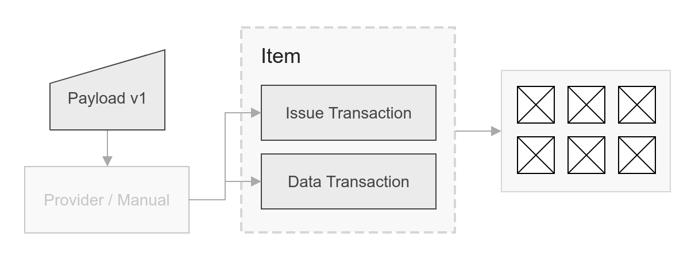

# Item Protocol Architecture

Representing an item on the Waves blockchain requires submitting two types of transactions with a specific format:

1. Issue Transaction
2. Data Transaction



## Issue Transaction

An **issue transaction** is a transaction that creates a new token (item)on the blockchain.

The issue transaction can be used to describe an asset (a primitive consensus entity) which will represent an item on the Waves blockchain.

### JSON representation

The JSON representation of an issue transaction within the Waves item protocol has the following format, Where the fields must have the values shown in the table:

| Field name | Field value |
| :--- | :--- |
| name | ITEM |
| description | empty |
| script | undefined |
| decimals | 0 |
| reissuable | false |

```
{
id: '8GyBZQjQ8GSpxvs9FWnu7MCCUzfJ45oVJQQb3ivLoA17',
type: 3,
version: 2,
name: 'ITEM',
description: '',
quantity: 100,
script: undefined,
decimals: 0,
reissuable: false,
fee: 100000000,
timestamp: 1562248791746,
chainId: 84,
senderPublicKey: '4Gqd2YuaCMh4PM6nVt33NJbETWMkJ5sHerJQCcd4Fbhe',
proofs: ['4HkJ5TLM7HFzuiLYrY7CTyoTXcNSVs4tBiMo2Jud7be6rF14Ja9AA2qujFwhFA3WGeRw2QxvuSnc3fceMXNBJpXs']
}
```

## Data Transaction

A **data transaction** is a transaction that writes data to an account data storage.

The data transaction describes the particular in-game item and holds all the metadata that particular game will use.

Each data transaction has a data entry that contains data to be written. In JSON representation of a transaction the data entry is the field **data**.

### Data entry of a data transaction

The maximum length of a data entry is 100 elements.

The maximum size of a data entry is 150 kilobytes.

Each element of a data entry is an object that has 3 fields: **key**, **type**, **value**.

An array cannot contain two elements with the same key field.

### The key field

The **key** field is a non-empty [UTF-8](https://en.wikipedia.org/wiki/UTF-8) string.

At the stage of transaction validation, the **key** field is converted from UTF-8 to UTF-16 encoding. The size of the resulting array of 16-bit words must not exceed 100 elements. Thus, the size of the **key** must be from 1 to 200 bytes inclusive.

### The type field

The **type** field specifies the type of the **value** field:

* 0 — integer
* 1 — boolean
* 2 — array of bytes
* 3 — string

### The value field

The size of **value** field can be from 0 to 32767 bytes.

### JSON representation

The JSON representation of a data transaction within the Waves item protocol has the following format, Where the fields must have the values shown in the table:

| Field name | Field value |
| :--- | :--- |
| data key | ID of the issue transaction  |
| data value | A serialized JSON string with an Item payload object |

```
{
id: 'DJadLmeQkcU4f7eGdXAqnSoKwLJbpZ3eXRMJSVcbnGT6',
type: 12,
version: 1,
data: [{
type: 'string',
key: '8GyBZQjQ8GSpxvs9FWnu7MCCUzfJ45oVJQQb3ivLoA17',
value: '{"version":1,"name":"The sword of pain","imageUrl":"https://i.pinimg.com/originals/02/c0/46/02c046b9ec76ebb3061515df8cb9f118.jpg","misc":{"damage":22,"power":13}}'
}]
fee: 100000,
timestamp: 1562248791771,
senderPublicKey: '4Gqd2YuaCMh4PM6nVt33NJbETWMkJ5sHerJQCcd4Fbhe',
proofs: ['4i4e4cCvTajmSUFonzeRGhMNxHMX5S5E3jaq1fDdJ7svC74vspRm8ZPSMX3zdx7AfZ51A85HMZj6ywrENuZxTKcK'],
}
```

## Item Payload

The Item payload (version 1) is an convention entity which describes the item and may contain the optional **misc** field with the item properties.

```
{
  "version": 1,
  "name": "The sword of pain",
  "imageUrl": "https://example.com/item.png",
  "misc": {
    "damage": 1
  }
}
```

### Create an item

Use the [provider npm package](https://github.com/wavesplatform/item/tree/master/packages/provider) `@item/provider` to create an item by one method.
